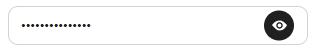

# Passhidder

*Passhider* is a component for Angular.
It's an input form that shows the password written at the press of a button.



## Instalation

To install use:
> npm install passhidder

## Usage

yourapp.module.ts

```
import { HideModule } from "passhidder"

@NgModule({
  declarations: [
    AppComponent
  ],
  imports: [
    BrowserModule,
    HideModule
  ],
  providers: [],
  bootstrap: [AppComponent]
})
export class AppModule { }

```


yourapp.component.ts

` <mssn-pass-input [(ngModel)]="mydata" placeholder="placeholder"></mssn-pass-input> `